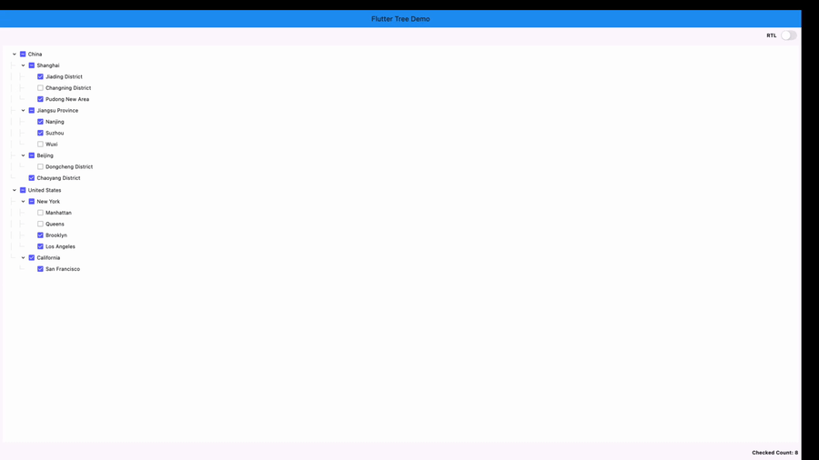

# flutter_tree_pro

A Flutter tree-select widget with checkbox selection, single-select mode, RTL support, and leaf-node drag-and-drop.

## Demo



## Features

- Build tree data from flat list (`DataType.DataList`) or nested map (`DataType.DataMap`)
- Multi-select with parent/child check-state synchronization
- Single-select mode with initial selected node
- Expand/collapse nodes
- RTL layout support
- Custom tree connector line style (`TreeLineStyle`)
- Drag-and-drop for leaf nodes
  - Drop on a non-leaf node: dragged leaf becomes a child of that node
  - Drop on a leaf node: dragged leaf is inserted after target leaf as a sibling

## Installation

Add dependency to your `pubspec.yaml`:

```yaml
dependencies:
  flutter_tree_pro: ^0.0.16
```

Then run:

```bash
flutter pub get
```

## Quick Start (DataList)

```dart
import 'package:flutter/material.dart';
import 'package:flutter_tree_pro/flutter_tree_pro.dart';

class TreeDemo extends StatefulWidget {
  const TreeDemo({super.key});

  @override
  State<TreeDemo> createState() => _TreeDemoState();
}

class _TreeDemoState extends State<TreeDemo> {
  final List<Map<String, dynamic>> listData = [
    {'id': 1001, 'parentId': 0, 'value': 'USA'},
    {'id': 1002, 'parentId': 1001, 'value': 'California'},
    {'id': 1003, 'parentId': 1002, 'value': 'San Francisco'},
    {'id': 1004, 'parentId': 1001, 'value': 'New York'},
  ];

  final List<Map<String, dynamic>> initialListData = [
    {'id': 1003, 'parentId': 1002, 'value': 'San Francisco'},
  ];

  List<Map<String, dynamic>> checked = [];

  @override
  Widget build(BuildContext context) {
    return Scaffold(
      appBar: AppBar(title: const Text('flutter_tree_pro')),
      body: FlutterTreePro(
        listData: listData,
        initialListData: initialListData,
        isExpanded: true,
        isRTL: false,
        isSingleSelect: false,
        config: const Config(
          dataType: DataType.DataList,
          id: 'id',
          parentId: 'parentId',
          label: 'value',
          children: 'children',
          lineStyle: TreeLineStyle(
            color: Color(0xFFE0E0E0),
            width: 1.0,
            indent: 28,
            showVerticalLine: true,
            showHorizontalLine: true,
          ),
        ),
        onChecked: (items) {
          setState(() {
            checked = items;
          });
        },
      ),
    );
  }
}
```

## Data Source Modes

### `DataType.DataList`

Use flat list data with `id` + `parentId` and pass it through `listData`.

Required fields in each item (or mapped by `Config`):
- `id`
- `parentId`
- `label` (for display text)

### `DataType.DataMap`

Use nested tree data with `children` and pass it through `treeData`.

If `treeData` is empty and `initialTreeData` is provided, `initialTreeData` will be used as fallback root data.

## API

### `FlutterTreePro` parameters

| Parameter | Type | Default | Description |
|---|---|---|---|
| `treeData` | `List<Map<String, dynamic>>` | `const []` | Tree source for `DataMap` mode |
| `listData` | `List<Map<String, dynamic>>` | `const []` | Flat source for `DataList` mode |
| `initialTreeData` | `Map<String, dynamic>` | `const {}` | Fallback root tree node when `treeData` is empty |
| `initialListData` | `List<Map<String, dynamic>>` | `const []` | Initial checked items in multi-select mode |
| `config` | `Config` | `const Config()` | Field mapping and tree style config |
| `onChecked` | `Function(List<Map<String, dynamic>>)` | required | Selection callback |
| `isExpanded` | `bool` | `false` | Expand all nodes initially |
| `isRTL` | `bool` | `false` | Enable right-to-left layout |
| `isSingleSelect` | `bool` | `false` | Enable single-select mode |
| `initialSelectValue` | `int` | `0` | Initial selected node ID in single-select mode |

### `Config`

| Field | Type | Default | Description |
|---|---|---|---|
| `dataType` | `DataType` | `DataType.DataMap` | Data mode |
| `id` | `String` | `'id'` | Node ID key |
| `parentId` | `String` | `'parentId'` | Parent ID key |
| `label` | `String` | `'label'` | Display text key |
| `value` | `String` | `'value'` | Reserved compatibility field |
| `children` | `String` | `'children'` | Children key |
| `lineStyle` | `TreeLineStyle` | `const TreeLineStyle()` | Connector line style |

### `TreeLineStyle`

| Field | Type | Default | Description |
|---|---|---|---|
| `color` | `Color` | `Color(0xFFD9D9D9)` | Line color |
| `width` | `double` | `1.0` | Line width |
| `indent` | `double` | `24.0` | Per-level indentation |
| `showVerticalLine` | `bool` | `true` | Show vertical connectors |
| `showHorizontalLine` | `bool` | `true` | Show horizontal connectors |

## Drag-and-Drop Rules

- Only leaf nodes can be dragged.
- A node cannot be dropped onto itself.
- A node cannot be dropped directly onto its current parent.
- Drop on a leaf node inserts after that target leaf, keeping the same parent level.
- Drop on a non-leaf node appends as the target node's child.

## Notes

- In multi-select mode, `onChecked` returns checked leaf nodes after internal filtering/deduplication.
- In single-select mode, `onChecked` returns at most one selected node.
- `Config.value` is reserved for compatibility and is not used by current select-state logic.

## Example Project

See `/example` for a runnable demo:

```bash
cd example
flutter pub get
flutter run
```

## License

MIT
